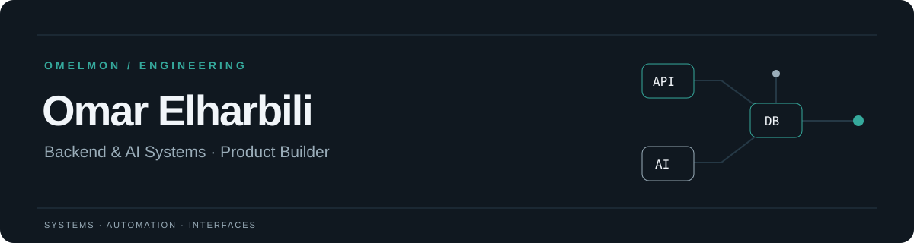
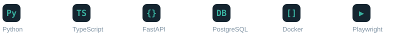

<picture>
  <source media="(prefers-color-scheme: dark)" srcset="assets/header-dark.svg">
  <source media="(prefers-color-scheme: light)" srcset="assets/header-light.svg">
  
</picture>

# Omar Elharbili

**Software Engineer | Backend & AI Systems | Product Builder**

I build software that connects a clear product idea to the systems behind it: APIs, data models, authentication, and usable interfaces. My public work spans service operations, browser automation, robotics simulation, and interactive product prototypes.

My focus is backend engineering and AI systems. Below are the implementations you can inspect, with the boundaries of each project made explicit.

[LinkedIn](https://www.linkedin.com/in/omar-elharbili/) · [Engineering repositories](https://github.com/OmElMon?tab=repositories)

## Selected engineering work

| Project | Engineering focus | Current scope |
| --- | --- | --- |
| **[Forge](https://github.com/OmElMon/Forge)** | Service operations platform with a FastAPI backend, PostgreSQL migrations, company-scoped access, background work, and a Next.js interface. | Active development; integration and deployment boundaries documented. |
| **[learn-once-replay](https://github.com/OmElMon/learn-once-replay)** | Browser automation that saves a validated capability discovered with a local model, then replays it with explicit recovery and human handoff. | Local prototype with contract, provider, and browser tests. |
| **[G27-Project](https://github.com/OmElMon/G27-Project)** | Team robotics project exploring ground vehicle and UAV coordination through CARLA, a message broker, controller logic, and logging. | Simulation and kinematic control; no real flight claim. |
| **[StudySpots](https://github.com/OmElMon/StudySpots)** | Café discovery demo combining a Python API, SQLite data, and a React interface with filtering and detail views. | Seeded demo; map and location flows have limitations. |
| **[MatchTalk](https://github.com/OmElMon/MatchTalk)** | A typed, mobile-first soccer companion built with Next.js, reusable UI components, and interactive match views. | UI prototype; sports data, chat, and predictions are mocked. |
| **[DeedSignal](https://github.com/OmElMon/DeedSignal)** | A dependency-free property discovery prototype with search, an auction calendar, watchlist interactions, and a bid calculator. | Illustrative data; no live records, checkout, or persistent accounts. |

## Engineering highlights

- **Backend and data boundaries:** Forge separates API endpoints, services, schemas, models, and migrations. Its repository includes tests for authorization, database availability, authentication, workflow transitions, and request logging.
- **AI with inspectable contracts:** learn-once-replay validates discovered capabilities before replay and exposes recovery paths instead of treating every browser interaction as a success.
- **Coordination and state:** G27-Project explores a broker-mediated control loop and explicit controller states in simulation. It is collaborative work, with attribution retained in the project documentation.
- **Product scope made visible:** MatchTalk and DeedSignal demonstrate interaction design while clearly distinguishing simulated behavior from integrated services.

## Tools in this work

**Languages:** Python · TypeScript · JavaScript  
**Backend & data:** FastAPI · Flask · PostgreSQL · SQLite · Redis  
**Interfaces & automation:** React · Next.js · Tailwind CSS · Playwright  
**Delivery:** Docker · GitHub Actions · Alembic

The project READMEs explain where each tool is used and which integrations remain incomplete.

## Activity

[Recent public work](https://github.com/OmElMon?tab=overview) · [Repositories and commit history](https://github.com/OmElMon?tab=repositories)

GitHub's native contribution graph below this README is the source for current activity.
